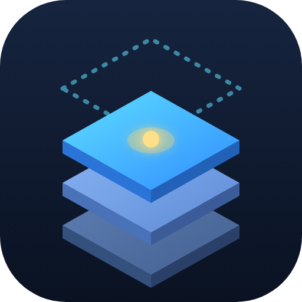
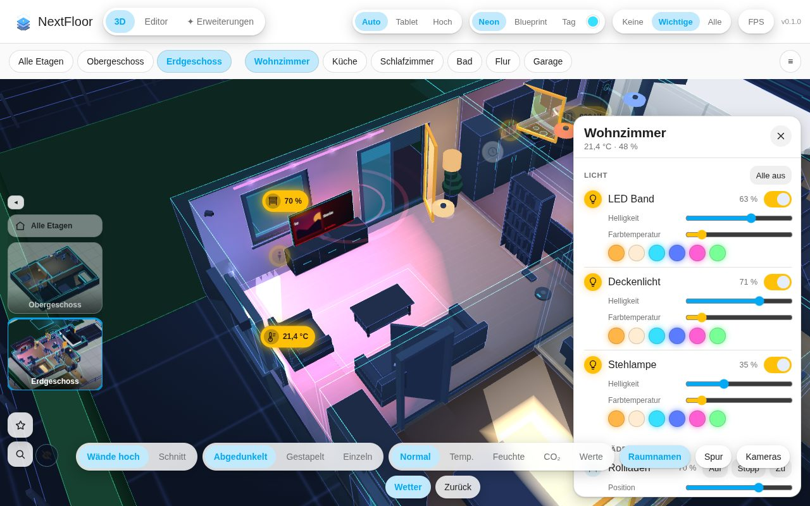
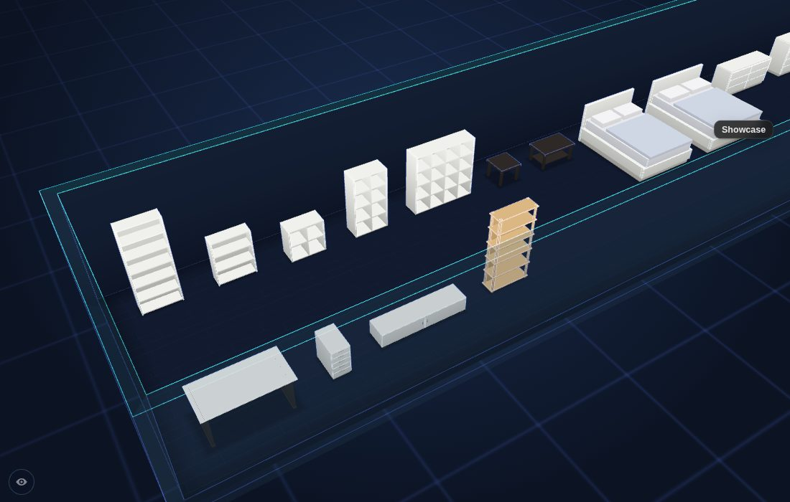
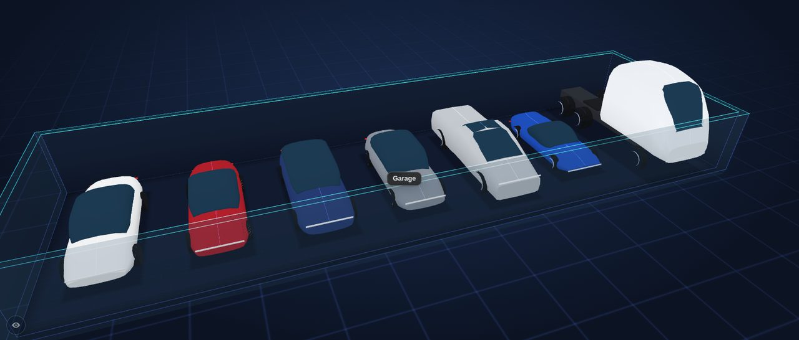
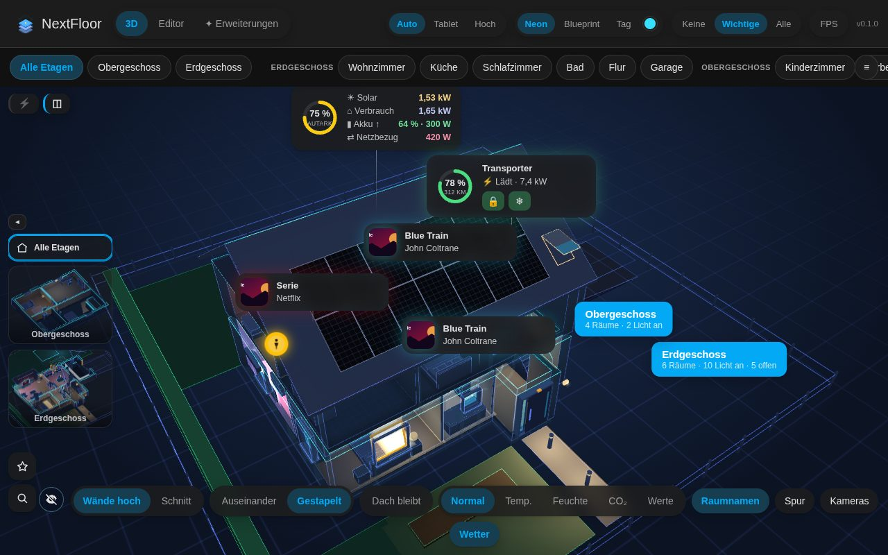

<p align="center"></p>

# NextFloor

Draw your home right inside Home Assistant and watch it live in 3D: a lamp switches on and the lamp in the model lights its room in the same colour, blinds move, doors and windows open, the TV shows what is playing, rain falls outside when it rains. No external tools, no cloud, made for wall tablets.

Free and open source (MIT). No account, no cloud, no licence keys.

[](https://my.home-assistant.io/redirect/hacs_repository/?owner=therealMRBK&repository=NextFloor&category=integration)


NextFloor sits in Home Assistant like one of its own pages: it takes the colours, the font and the corner radius from your theme and follows light and dark mode.

| Dark theme | Light theme |
|---|---|
|  |  |

▶️ **[Try the online demo](https://therealmrbk.github.io/NextFloor/)** in your browser, with invented demo data. Nothing to install.

📖 **Manual:** [English](docs/manual.md) · [Deutsch](docs/anleitung.md) · 🗺️ [Roadmap](ROADMAP.md) · 📝 [Changelog](CHANGELOG.md)

## What it does

| | |
|---|---|
|  | **Plan editor in Home Assistant**: floors, rooms as rectangles or free shapes, automatic walls and free-standing partitions, doors, windows, garage doors, stairs, floor openings, outdoor areas and a roof. The 3D view runs next to the plan while you draw. |
|  | **Live 3D view**: tap a lamp to switch it, swipe to dim, long press for colours. Blinds follow their position, windows tilt and open, doors swing. A room panel lists everything in the room's area. |
|  | **Furniture and lamps**: 40 basic models plus 10 built-in packs with over 100 more (living, kitchen, bath, bedroom, home cinema, office and homelab, fitness, garden, energy, vehicles with the Tesla models, and a pack of popular furniture sizes). Lamps light their room in their own colour; TVs, washing machines and radiators glow while they run. |
|  | **Furniture in familiar sizes**: bookcases, cube shelves, beds, chests of drawers, wardrobes, sofas and desks in the published outer dimensions of popular IKEA pieces (Billy, Kallax, Malm, Pax, Ektorp …). They are simple models of those sizes, not IKEA's designs. |
|  | **Vehicles**: Tesla Model S, 3, X, Y, Cybertruck, Roadster and Semi with their real outer dimensions, plus an electric SUV, a small car, a van, bikes and a trailer. Put one on a parking spot and its car card follows it. |
|  | **Floors and looks**: open a single floor, stack them or cut the walls. Three looks (*Neon*, *Blueprint*, *Day*), a heatmap for temperature, humidity and CO₂, and sunlight through the windows from `sun.sun`. |
|  | **Wall tablet ready**: warnings for smoke, gas, water, alarm and windows open in the rain, a kiosk mode with idle return and night dimming, scene buttons, and a *Tablet* quality level for Fire tablets. |
|  | **Dashboard card**: `custom:nextfloor-card` with a visual editor, loaded automatically. |

## Live features

| | |
|---|---|
|  | **Weather outside**: rain, snow, fog, clouds, lightning, sun and moon around the house, taken from a `weather` entity.  |
|  | **Energy flow**: solar fields on the roof light up with their output, glowing lines run from the panels, battery and grid to the house and the wallbox, and a live card shows the balance. Set up the sources in the editor's energy tab.  |
|  | **TV screens**: TVs show the cover, title, artist and app on a gradient in the app's colour, with a breathing ambilight on the wall. A player placed next to a TV counts as that TV's player. |
|  | **Cameras**: a camera wall with every live picture, and a flight into a camera that fades into its live stream. Pins show what it detects (person, vehicle, animal).  |
|  | **Motion trail**: where motion was reported in the last 30 minutes, in time order, as a glowing path through the house with times. |
|  | **Car and sound**: a car on its parking spot shows its charge level and charging state on a live card. Speakers pulse while they play. |

## Installation

### HACS

1. Click the button above, or in HACS go to ⋮ → *Custom repositories* and add `https://github.com/therealMRBK/NextFloor` as **Integration**.
2. Install **NextFloor** and restart Home Assistant.
3. Add the integration:

   [](https://my.home-assistant.io/redirect/config_flow_start/?domain=nextfloor)

   or go to *Settings → Devices & services → Add integration → NextFloor*.
4. Open **NextFloor** in the sidebar, switch to **Editor** and draw your first floor.

### Manual

Copy `custom_components/nextfloor` into `config/custom_components/` and restart Home Assistant.

Requires Home Assistant 2025.1 or newer.

## Dashboard card

All options can be set in the card's visual editor. In YAML:

```yaml
type: custom:nextfloor-card
floor: floor_ab12cd34   # optional: show a single floor (id from the editor)
room: room_ab12cd34     # optional: start in this room
height: 420             # optional: height in pixels
fill: false             # optional: fill the screen below the dashboard header instead of a height
walls: auto             # optional: auto | cut
explode: true           # optional: pull floors apart in the house view
floor_stack: dim        # optional: floors below an opened floor: dim | stacked | single
quality: auto           # optional: auto | low | high
theme: neon             # optional: neon | blueprint | day
accent: "#00e5ff"       # optional: accent colour for the neon look
markers: important      # optional: none | important | all
heatmap: none           # optional: none | temperature | humidity | co2
room_panel: true        # optional: tapping a room opens its details
room_names: true        # optional: room names in 3D
controls: true          # optional: switches in the card, or a list of walls, floors, temperature, humidity, co2
floor_thumbs: true      # optional: floor pictures to switch floors
fullscreen_button: false
stats: false            # optional: performance display
alerts: true            # optional: smoke, gas, CO, water, alarm and windows open in the rain pulse
alert_jump: false       # optional: jump to the room of a new warning
scenes: true            # optional: scene and script buttons of the selected room
energy: true            # optional: energy values at the top
flows: true             # optional: power flow lines always on (true) or off (false); leave out for a switch
holograms: true         # optional: live cards (energy balance, car, media) always on or off; leave out for a switch
weather: true           # optional: weather outside
weather_entity: weather.home   # optional: which weather entity (default: as set in the plan)
camera_wall: false      # optional: a "Cameras" button that opens the camera wall
motion_trail: false     # optional: motion of the last 30 minutes
idle_return: 0          # optional: kiosk, seconds without a touch until the start view returns
night: "off"            # optional: kiosk, dim at night: off | sun | "22:00-06:00"
idle_orbit: false       # optional: kiosk, slow camera turn after the idle return
```

## Privacy

NextFloor stores the plan, its pictures and the packs in Home Assistant's `.storage`. It does not talk to the internet. Camera pictures and history come from your own Home Assistant.

## Development

```bash
cd frontend
npm install
npm test            # pure logic
npm run typecheck
npm run build       # writes the bundles to custom_components/nextfloor/frontend (committed)
npm run screenshot  # renders preview/index.html (invented demo data) with a local Chrome or Chromium
```

- **Preview without Home Assistant**: open `preview/index.html` through any local web server.
- **Deploy to a test instance**: create `deploy.local.json` with `{"target": "<config>/custom_components/nextfloor"}` and run `npm run deploy` in `frontend/`.
- **Python tests** run in CI with `pytest-homeassistant-custom-component`.
- **Furniture packs**: the built-in packs are generated by `tools/build_packs.py`. The format of your own packs is described in [docs/packs.md](docs/packs.md) (German).

## Ideas, questions and bugs

- **Ideas and questions:** [Discussions](https://github.com/therealMRBK/NextFloor/discussions).
- **Bugs:** [open an issue](https://github.com/therealMRBK/NextFloor/issues/new/choose).

## Licence

MIT, see [LICENSE](LICENSE). NextFloor ships [three.js](https://threejs.org) (MIT), [Lit](https://lit.dev) (BSD-3-Clause); their notices are in [THIRD_PARTY_NOTICES.md](THIRD_PARTY_NOTICES.md).

"Home Assistant" is a trademark of its owners; "Tesla" and the Tesla model names are trademarks of Tesla, Inc., and "IKEA" and its product names are trademarks of Inter IKEA Systems B.V.; they are used here only to name the sizes and models. NextFloor is an independent community project and not affiliated with or endorsed by Nabu Casa, Tesla or IKEA.
