# NextFloor – Manual

🇬🇧 English · [🇩🇪 Deutsch](anleitung.md)

NextFloor draws your home right inside Home Assistant and shows it as a 3D model in a neon look. Lights glow in their colours, blinds move, windows tilt, doors swing open, cameras look into the room and the TV shows what is playing. Everything runs locally in Home Assistant, without a cloud or external programs, and it is built for wall tablets.

This manual describes every feature of the current version. What changed in which version is in the [changelog](../CHANGELOG.md) and on the [releases page](https://github.com/therealMRBK/NextFloor/releases). The pictures come from the demo with invented data. The app follows the language of your Home Assistant user (profile → language); the labels below are the English ones. German and English are built in; French, Spanish, Dutch, Italian, Hungarian, Danish, Swedish, Norwegian (Bokmål and Nynorsk), Finnish, Czech, Polish, Romanian and Slovenian are fetched when needed, so the bundles stay small for wall tablets. A text missing in a language shows in English.

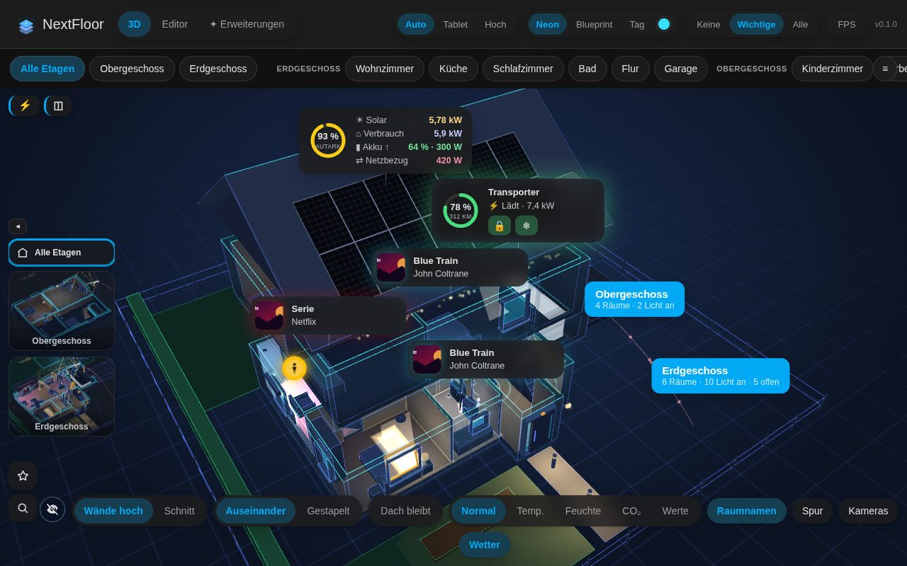

---

## Contents

1. [Installation](#1-installation)
2. [Your first 3D plan in ten minutes](#2-your-first-3d-plan-in-ten-minutes)
3. [The interface at a glance](#3-the-interface-at-a-glance)
4. [The editor](#4-the-editor)
5. [The 3D view](#5-the-3d-view)
6. [Live features](#6-live-features)
7. [Extensions and furniture packs](#7-extensions-and-furniture-packs)
8. [The dashboard card](#8-the-dashboard-card)
9. [NextFloor on a wall tablet](#9-nextfloor-3d-on-a-wall-tablet)
10. [Backup and moving](#10-backup-and-moving)
11. [Data and privacy](#11-data-and-privacy)
12. [FAQ and troubleshooting](#12-faq-and-troubleshooting)

---

## 1. Installation

### Requirements

- Home Assistant 2025.1 or newer.
- A browser with WebGL. That is every current browser, the Home Assistant app and Amazon Fire tablets.
- An administrator to edit. All other users see and control the plan but do not change it.

### With HACS

[](https://my.home-assistant.io/redirect/hacs_repository/?owner=therealMRBK&repository=NextFloor&category=integration)

The button opens NextFloor straight in the HACS of your installation. By hand:

1. Open **HACS** in Home Assistant.
2. Choose **⋮ → Custom repositories** at the top right.
3. Enter `https://github.com/therealMRBK/NextFloor`, type **Integration**, and add it.
4. Search for **NextFloor**, install it and restart Home Assistant.
5. **Settings → Devices & services → Add integration → NextFloor**, or straight with this button:

   [](https://my.home-assistant.io/redirect/config_flow_start/?domain=nextfloor)

**NextFloor** now appears in the sidebar. The dashboard card is available right away, no resource needed.

### By hand

Copy the folder `custom_components/nextfloor` from the repository into `config/custom_components/`, restart Home Assistant and add the integration as above.

### Updates

HACS reports new versions by itself. Restart Home Assistant after every update. Until then NextFloor shows a note at the top that a restart is pending. Your plan always stays, even if you remove the integration and add it again.

---

## 2. Your first 3D plan in ten minutes

1. Open **NextFloor** in the sidebar and switch to **Editor** at the top.
2. Choose **Add floor** on the right. If you have floors in Home Assistant, NextFloor offers them directly.
3. If the floor has areas, **"Add … rooms from HA areas"** creates a room for each area. Drag the rooms into place and adjust the corners. Or draw with **Rectangle** or **Free shape**.
4. Tap a wall with **Doors & windows** to add doors and windows.
5. Tap a room and tap **Place** under **Devices** on the right for the devices you want, e.g. the lights, covers, thermostats, media players and sensors of the area. Below the list, **Place all …** puts all main devices in at once after asking.
6. Furnish the room with **Furniture** and **Furnish …**.
7. Switch to **3D** at the top. Done: tap a lamp, and it switches.

The plan saves itself while you edit.

---

## 3. The interface at a glance

There are three tabs at the top:

| Tab | What for | Who sees it |
|---|---|---|
| **3D** | Look at the house and control it | everyone |
| **Editor** | Draw the floor plan, place furniture and devices | administrators |
| **✦ Extensions** | Live features, furniture packs | administrators |

The dashboard card brings the same 3D view into any dashboard. See [chapter 8](#8-the-dashboard-card).

The look follows your Home Assistant theme: colours, font and corner radius come from it, and the interface switches between light and dark with it. The three looks of the 3D model (Neon, Blueprint, Day) are independent of that and are chosen in the bar at the top.

---

## 4. The editor

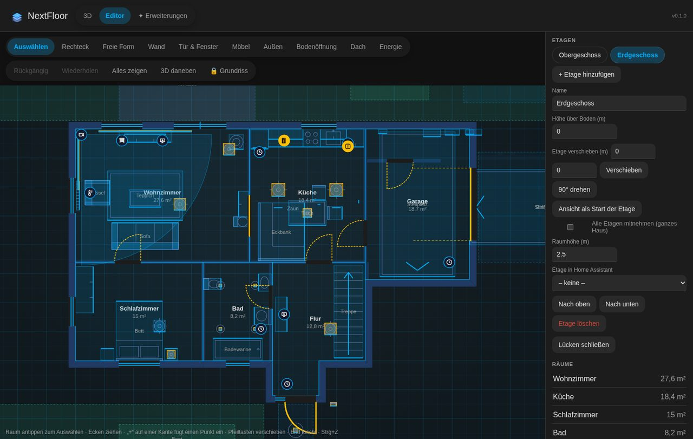

The editor has the floor plan in the middle, the toolbar at the top and the sidebar on the right. The sidebar always shows what is selected: the floor, a room, an item, a door or a device.

### 4.1 Tools

| Tool | What it does |
|---|---|
| **Select** | Tap rooms, furniture, doors, windows and devices, move them, drag corners |
| **Rectangle** | Draw a rectangular room |
| **Free shape** | Draw a room corner by corner |
| **Wall** | Draw a single free-standing wall, e.g. a partition |
| **Doors & windows** | Tap a wall to add an opening |
| **Furniture** | Open the furniture library |
| **Outdoor** | Draw outdoor areas such as lawn, terrace or pool |
| **Floor opening** | Draw a hole into the floor, e.g. above the staircase |
| **Roof** | Draw, move and set up roof sections, see [4.19](#419-roof) |
| **Energy** | Solar fields on the roof and in the garden, strings, see [4.20](#420-energy-solar-fields) |

Next to them are **Undo**, **Redo**, **Show all** and **3D beside**. A short hint for the active tool is always shown at the bottom of the plan.

**Mouse and touch:** Two fingers pan and zoom. With a mouse, the wheel zooms and dragging an empty spot pans. **Ctrl+Z** undoes, **Ctrl+Y** or **Ctrl+Shift+Z** redoes, **Del** deletes the selection, **Esc** cancels. The **arrow keys** nudge the selection (room, corner, furniture, device, wall, outdoor area) by one grid step, with **Shift** by 10 cm, with **Alt** by 1 cm; doors and windows slide along their wall.

**Locking the floor plan and fixing:** **🔒 Floor plan** in the toolbar locks all rooms, walls, doors, windows and outdoor areas, newly drawn ones too; a selected room then shows "🔒 Floor plan locked", a click on it unlocks. Furniture and devices are fixed one by one once they are in place: with the lock **🔓 Fix** at the top of the form, with the key **L** or by **right-click** (long press on a tablet). The right-click menu also offers **Duplicate**, **Turn 90°** and **Delete**. Locked items can be selected and edited in their form, but not dragged, not nudged with the arrow keys and only deleted after asking; dragging then moves the view. Fixed furniture and devices also stay put in the 3D half.

### 4.2 Floors

Without a selection, the sidebar shows the floors:

- **Add floor** creates a floor. Home Assistant floors that are still missing are offered.
- **Name**, **height above the ground** and **ceiling height** set where the floor sits in the 3D house and how tall its walls are. **Turn 90°** turns everything on the floor about the middle of its rooms when a floor was drawn the wrong way round. **Shift the floor** moves everything on the floor (rooms, furniture, devices, outdoor areas, free walls, background image) by X and Z when a floor sits offset against the others; roof sections stay. With **Take every floor along** ticked, shift and turn act on the whole house: every floor with the roof sections, outdoor areas and meter. **View as this floor's start** remembers how the 3D pane beside stands right now – this floor then opens from that side, with that zoom and framing, e.g. the ground floor from the front and the upper floor from the back; ↺ removes it.
- **Background picture:** in the **Background** section you load a photo or scan of your floor plan as a template under the plan (opacity adjustable). **Move, scale and turn** gives the picture handles in the plan like a piece of furniture: drag moves it, the lower right corner scales it, the round handle on top turns it (Shift for 15° steps). **Done** fixes it again, so you can draw over it undisturbed. **Rotation (°)** turns it to a tenth of a degree. The easiest way to the scale is **📏 Scale with a ruler**: tap the start and end of a stretch of known length in the picture (a dimensioned wall), enter the real length – the picture is scaled to fit and the first point stays put. A skewed scan is put straight with **📐 Straighten**: tap two points on a wall in the picture that should run horizontally or vertically – the picture turns to fit. Order: straighten first, then the scale, then draw the rooms over it.
- **Floor in Home Assistant** links the floor to an HA floor. Then **"Add … rooms from HA areas"** offers the areas of that floor as rooms.
- **Move up** and **Move down** change the order, **Delete floor** removes it with its rooms.
- **Close gaps** joins rooms that are up to 60 cm apart. This helps when you measured inside dimensions. The gap becomes the interior wall thickness.

### 4.3 Drawing rooms

- **Rectangle:** Tap the plan and drag.
- **Free shape:** Set corner after corner. A tap on the first corner or **Enter** closes the room, **Esc** cancels.
- **Moving corners:** Tap a room with **Select** and drag its corners. The **+** on an edge inserts a corner.
- **Snapping:** Corners snap to the grid, to corners and edges of other rooms and to alignments. Hold **Alt** to move freely.

A selected room shows on the right:

- **Name** and **Area**: The link to a Home Assistant area matters most. Through it NextFloor finds the room's lights, covers, sensors and scenes.
- **Floor**: wood, oak, tiles, carpet, stone or concrete show as a subtle pattern in 3D.
- **View as this room's start**: turn on **3D beside**, turn and zoom the room the way it should show, then tap the button. When you tap the room in 3D later, the camera flies right there – angle, zoom and framing. ↺ removes it, and the room is shown from above again.
- The **Devices** of the area, see [4.10](#410-devices).
- **Furnish …** for ready-made furniture sets, see [4.9](#49-furnishing-rooms).
- **Duplicate** and **Delete**.

### 4.4 Walls

Walls are created automatically: every shared edge of two rooms becomes an interior wall, every outer edge an exterior wall. Corners and T-junctions are mitred. You set the thicknesses under **Settings**.

**Single walls:** The **Wall** tool draws a free-standing wall, e.g. a partition that runs through half a room. **Shift** keeps it straight, **Alt** draws without snapping. Where it meets a room wall, the corner is mitred. When selected, drag the handles to move its ends or the line to move the whole wall. On the right you set **Length**, **Wall thickness** and **Height**. In 3D it behaves like any interior wall. You can put doors and windows into single walls too, with **Doors & windows** (see 4.7). Deleting the wall removes its doors and windows as well.

**Wall height:** Any wall can be lower than the room, e.g. a parapet or a counter. For a single wall you set its **Height** in the form. For rooms (rectangle and free shape) select the room; the form shows the **Wall heights** box with every wall of the room, named by its corners (e.g. "Wall 2–3", the numbers are shown at the corners in the plan) and with its length. Hovering a row or tapping its field lights the wall up in the plan. ↥ resets it to full room height. If two rooms share the wall, the lower setting applies. Windows and doors in a low wall end at the wall height. Low walls look lighter in the plan. If one wall in line should have two heights (2.5 m next to 1.7 m), split it with **✂**: the part gets a row and a height of its own, the split point can be moved in **Split point from corner** (marked by a tick in the plan), **⨉** joins the parts again.

**Thickness per wall:** in the same box every wall has a **Thickness (m)** field. By default it is the house's thickness (exterior or interior wall, chapter 4.4); a setting of its own makes the 36.5 cm outer wall next to a 24 cm one, or the 11.5 cm partition. If two rooms share the wall, the thicker setting applies and the wall stays centred on the room border. ↺ goes back to the house's thickness. Windows and doors follow the thickness.

**No wall:** In open floor plans the hall, kitchen and living room are one space, yet separate areas in Home Assistant. For that, every row in the **Wall heights** box has a **No wall** button: the wall is left out in the plan and in 3D, even when the neighbouring room shares it. ↥ brings it back. The light follows: a lamp shines through the left-out wall into the neighbouring room as if it were one room.

**Split walls:** When a neighbouring room splits a wall into several parts (say two small rooms along one long wall), every part gets a row of its own, "Wall 2–3 · part 1", "… part 2", with its length, and every part can have its own height or be left out.

### 4.5 Settings

**Settings** unfolds at the bottom of the sidebar:

| Setting | Meaning |
|---|---|
| **Exterior wall (m)**, **Interior wall (m)** | Wall thicknesses |
| **Grid (m)** | Drawing step |
| **North** | Degrees clockwise from up. Needed for sunlight |
| **Roof** | No roof, flat roof or gable roof, with pitch and overhang. For a gable roof, **Ridge** sets whether the ridge runs along the long or the short side (e.g. terraced house). **Roof sections (custom)** builds the roof from several parts, see [4.19](#419-roof) |
| **Weather entity** | Which weather entity drives the weather outside, see [6.2](#62-weather-outside) |
| **Weather effects in 3D** | Which effects are shown |
| **Start view** | Turn, zoom and move the house in the 3D pane on the right the way it should open (e.g. from the garden side) and press **Remember the current 3D view as the start**. The 3D view, the card and the kiosk then open the house like that – angle, zoom and framing – and an opened floor is shown from the same side as well; **Default** resets it |
| **Favourites** | Scenes, scripts, automations, buttons and switches for the central menu (star) of the 3D view: party, presence simulation, shading, watering. Pick them with the search, order them with ↑ ↓, ✕ removes one. Below them **Own buttons** with a label, an icon and an action: **Open a path** (e.g. `/lovelace/blinds`), **Entity details**, **Call a service** (`domain.service` with data as JSON) or **fire-dom-event** – with it a button opens a browser_mod popup with your own card, e.g. `{"browser_mod": {"service": "browser_mod.popup", "data": {"title": "Blinds", "content": {"type": "custom:my-blind-card"}}}}` |

### 4.6 Floor plan image as a template

Under **Template (floor plan image)** you load a photo or scan of your floor plan under the drawing. **Width in plan (m)** brings it to scale, **Opacity** makes it subtler. Then simply trace the rooms.

### 4.7 Doors, windows and garage doors

With **Doors & windows** you tap a wall, a room wall or a single wall. Then you choose the **Type** on the right: door, window or garage door. A window with a sill of 0 is a terrace door. The preset **Glass wall** sets fixed floor-to-ceiling glazing with slim mullions and no sashes – for an indoor glass wall or partition; width and height are free, and any window can take it under **Style**.

Every opening has:

- **Width**, **sill** and **height**, plus the hinge side. With **Select** you slide it along the wall.
- **Style:** room door, front door, front door with glass, with one or two sidelights, glass door, sliding door or **Opening (no door)**. With sidelights you set their **width** below (empty = automatic), with two the left and the right one separately; a single sidelight sits opposite the hinge, or next to the hinges with **Sidelight on the hinge side**. An opening is just a gap in the wall, without frame and leaf; light always passes through. Windows come as standard or with glazing bars. "Automatic" picks a front door for exterior doors.
- **Leaves:** single or double, with an own contact for the second leaf.
- **Highlight in 3D:** *When open* (default) makes open windows and doors glow warm. *When closed* turns this round, e.g. for the WC or a child's room door: it glows while it is shut. This needs a contact; without a sensor nothing is highlighted.
- **Show closed without a sensor:** a door without a contact stands half open in 3D, so it is seen as a door. The checkbox draws it closed, e.g. for a front door or a carport without a sensor.

**Sensors:**

| Field | Effect in 3D |
|---|---|
| **Cover** | The blind moves in front of the window – or of a door (front door, French window, sliding door) – with the cover's position |
| **Position sensor** | For blinds whose position comes from a separate sensor, e.g. Homematic. Can be inverted |
| **Ask before switching** | Open, close and positions ask first in the quick menu and the room panel, and a swipe on the marker no longer moves the blind (it turns the view instead). Stop never asks. Good for tablets where blinds or the garage door would otherwise move by accident |
| **Contact** | The door swings open, the window opens |
| **Tilt contact** | A second sensor that reports "tilted" |
| **Tilt angle sensor** | Optional: a sensor reporting the tilt angle in degrees (e.g. the "Rotation" of a Shelly BLU Door/Window). The sash tilts exactly that far in 3D; **Angle that counts as fully tilted** (15° by default), an **Offset** for the value while closed and **counts the other way round** adapt it to the mounting. Above a small angle the window counts as tilted, also for the rain warning |
| **Contact second leaf** | For double windows and doors |
| **Garage door** | A garage door follows a cover entity or a contact. Its open part lies under the ceiling |

NextFloor matches covers and contacts through the area automatically. You can change them by hand at any time.

### 4.8 Furniture

The **Furniture** tool opens the library with 40 built-in models in the sections Lights, Living, Dining, Kitchen, Sleeping, Bath & laundry and Work & other. Your installed furniture packs follow below. The **Worktop** (Kitchen and Work & other) is a free top without a base, for gaps in the kitchen or a self-built desk; its **height** is the top edge, 91 cm by default. The search field filters all sections and stays put while you scroll; it finds English and German names and the pack name, several words in any order ("corner sofa"), Escape clears it. Sections fold open and closed. Hover over an entry for a small 3D preview.

**Symbols on the entries:**

- 💡 A **lamp**: it links to a light and switches in 3D.
- ⚡ An **electric item**: it takes an entity and a power sensor, e.g. a TV, a washing machine or a thermostat.

**Placing and editing:**

- Tap a room, then pick an entry. The item appears in the room.
- **Drag** to move it. Near a wall it turns its back to the wall and sits flush. **Alt** moves freely.
- The **handle in front of the item** turns it in 15° steps, the **corners** resize it.
- On the right you set width, depth, height, rotation and **Height above the floor**. **Mirror** swaps left and right – the L-sofa the other way round, the cabinet with its door on the other side; the item is in the right-click menu and in the furnish bar of the 3D view as well. That is how a network cabinet or a shelf hangs on the wall, or a dryer stands on the washing machine. It always counts from the floor: a wall cabinet sits at 1.45 m by default, a wall TV is centred at 1.3 m; you can set both higher or lower. **Automatic height** resets it.
- **State from:** any piece of furniture can show an entity that reports on, occupied or home – its top then glows: the bed with an occupancy mat, the armchair, the sauna. A second entity lights the other half (left/right, bottom/top for a bunk bed). Lamps, energy devices and screens have fields of their own for this.
- **Duplicate** and **Delete** are there too.

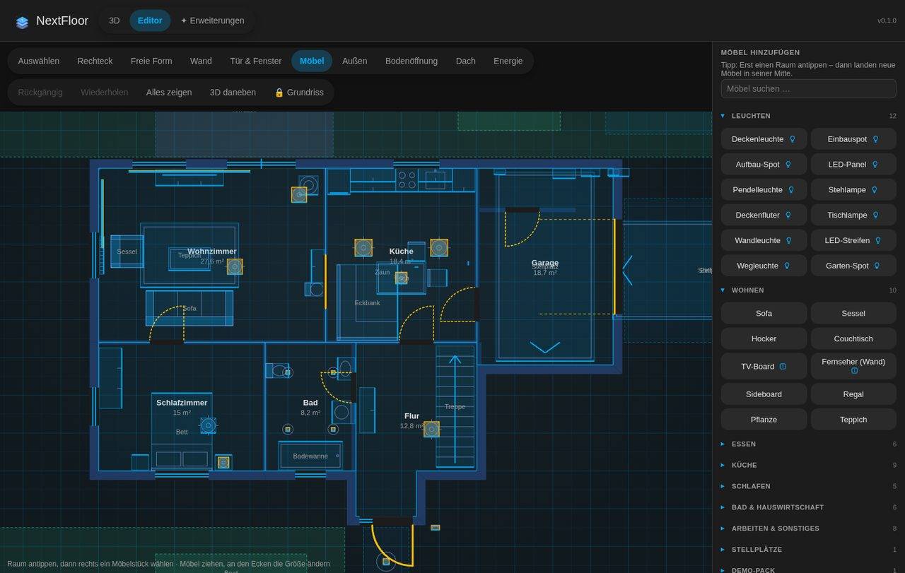

### 4.9 Furnishing rooms

**Furnish …** on a room puts a whole set of furniture against the walls: kitchen row, L-shaped kitchen, bathroom, bedroom, living room, dining room, office, kids' room or hall. Lamps link to the area's lights. Adjust single items afterwards. **Ctrl+Z** takes the whole set back.

### 4.10 Devices

A room with an area lists all devices of that area on the right, grouped by device. The main entity comes first, further ones such as LED indicators or effects sit behind **"+n more"**. A search field helps with big areas.

Sensors appear when they measure something for the room: temperature, humidity, CO₂ and air quality, power and energy, gas and water meters, illuminance and pressure. Meters without a device class count too when their unit fits (m³, l, kWh, lx). Battery and signal sensors stay out. The value shows the decimals set in Home Assistant. If a device is missing, check in Home Assistant that it is assigned to the room's area.

Above the list you choose the source: **This area** (default), **Other areas** (the devices of the other areas, grouped by area; if a device already stands in another room, that is shown, and **Place** brings it here) or **No area** (e.g. template lights, groups and helpers; here any sensor with a numeric value and a unit counts). The area in Home Assistant does not change.

**Room climate:** In the room form, **Room climate** sets which sensors give the room's temperature, humidity and CO₂ (heatmap and room panel). *Automatic* takes the sensors of the area and the ones placed in the room, but leaves out device temperatures, e.g. of a 3D printer or a heat pump's flow. *None* hides the value.

- **Place** puts a device into the room. **Place all …** below the list puts all main devices in at once after asking; **Undo** (Ctrl+Z) takes them back in one step.
- Lights are placed as lamps from the library, so they glow in 3D.
- **☆** adds a device to the room panel of the 3D view without placing it. **👁** hides an entity of the area from the room panel (struck through in the list, 🙈 brings it back) – for entities that only clutter it. **Aa** hides only a device's state in the room panel (∅ shows it again), e.g. for a cover without feedback; a bare "unknown" is left out for switches, covers and lights anyway.
- Drag a placed device to its spot in the plan.

A selected device has:

- **Marker height**, **rotation** and, for lights, the **mount**: ceiling, floor, table or wall.
- **Ask before switching:** A tap in 3D, the quick menu and the room panel ask first. This protects, for example, a server switch from an accidental tap. A double tap on the room leaves this device out.
- **Marker in 3D:** *Automatic* follows the None / Important / All switch of the 3D view. *Always show* shows the marker with "Important" too, e.g. for a temperature sensor. *Without watts* leaves out the power, e.g. on a smart plug. *Hide* never shows a marker. With "None" all markers stay off.
- **Own symbol:** the name of a Material Design icon as in Home Assistant, e.g. `mdi:thermometer` or `mdi:water-alert`, replaces the symbol of the device kind in the pin. Leave it empty for the default. Works for electric furniture just the same.
- **Show as furniture:** replaces the pin by a fitting furniture item in the same place, already linked to the device – a speaker or smart display for a media player, a lamp for a light, a radiator for a thermostat, the robot vacuum for a vacuum. The list only shows furniture that fits the kind of device. In the furniture form **Back to a device pin** brings the plain pin back; Ctrl+Z undoes either.
- **Own name** and **Show the name under the marker in 3D:** ticked, the own name sits small under the pin – three thermometers in the garden ("Pool water", "Pool air", "Greenhouse") stay apart. The tick appears as soon as an own name is set; furniture with an own name has it too. The card option `marker_names: true` shows the names of every device with an own name.
- **To room centre** and **Remove**.

### 4.11 Lamps

Lamps are furniture with a linked light: ceiling light, downlight, surface spot, LED panel, pendant, floor lamp, uplight, table lamp, wall light, LED strip, path light and garden spot.

- The 3D model glows in the light's colour and brightness. The room's floor and walls are lit too, two coloured ceiling lights mix in between. Light reaches the next room only through doors.
- Colour effects such as a colour loop are animated in 3D.
- Table lamps stand on the item below, wall lights and LED strips snap to the wall, a pendant's height is how far it hangs below the ceiling.
- **Height above floor:** wall lights hang at 1.75 m by default, LED strips right under the ceiling. In the form you set a **Height above floor** of their own, e.g. for a strip under the wall cabinets or behind the TV unit. **Automatic height** resets it. A strip below 1 m (skirting board, behind a cabinet) shines up the wall, higher strips shine down. A strip below the cut height stays visible with cut walls. **Tilt about its length** lays the strip against a roof slope or turns it sideways (90° = its face points to the side); **Upright** stands it on end: it then runs up from the height above the floor, along a door frame or as a light column, and shines all around.
- **Colour and brightness from:** when a relay (Shelly, switch actuator) switches the lamp while the bulb itself knows its colour and brightness, on/off comes from the switch and the colour from this second entity.
- **Glow in 3D (%):** how strongly the lamp glows in 3D. Below 100 % tones down bright LED strips so the room does not burn out, above 100 % makes a weak lamp glow more. Works for lights placed as devices too; it switches nothing in Home Assistant.
- A switch works instead of a light too, e.g. a relay for the ceiling light.
- Several lamps may follow the same light.

**Place spots** on a room lays out a grid of lamps that all follow one light, e.g. six downlights on one dimmer. Choose columns and rows first.

### 4.12 Electric furniture

TVs, media walls, the wall unit with a TV (the wall unit without a TV is a lamp: vitrines and LED strips glow with the linked light), desks with monitors, washing machines, dryers, dishwashers, radiators, robot vacuums and many pack items link to entities:

- **Device** or **TV (media player or smart plug)**: A **status sensor** works as a device too, e.g. the print status of a 3D printer (Bambu Lab and others); the item then counts as active while the status reports "running", "printing", "prepare" or similar. A TV glows while it is on. An older TV on a smart plug simply takes the plug's switch; the screen glows while the plug is on, and a tap switches it. Washing machine, dryer and dishwasher glow while they run. A radiator with a thermostat glows while it heats.
- **Power sensor (W)**: The item shows its watts.
- **Ask before switching** and **Marker in 3D** as with devices.
- **TV screens** on TVs: see [6.3](#63-tv-screens).

"Automatic" means NextFloor finds the matching entity in the area by itself.

### 4.13 Cameras

Place cameras like any device. Then:

- **Mount:** wall, looking along its rotation, or ceiling as a dome that sees all round.
- In the plan a **wedge** shows where the camera looks. The **handle at its tip** turns the camera and sets its reach at the same time.
- **Show the field of view in 3D** can be switched off per camera. In 3D the wedge ends at the first wall: an indoor camera does not see through the wall into the next room.
- **Field of view (°)**, **Reach (m)** and **Tilt down (°)** can be typed in as numbers.

In 3D the camera hangs as a small model on the wall or ceiling, its field of view lies on the floor as a wedge. When a motion or presence sensor of the camera reports motion, the wedge turns red.

### 4.14 Parking spots and vehicles

The item **Parking spot** in the Parking group marks where a car stands: in the garage, on the driveway or anywhere on the plot.

- **Sensor "car present":** a `binary_sensor`, `device_tracker` or similar. While it reports a car, the vehicle is there.
- **Vehicle:** the model from the "Vehicles" pack.
- **Vehicle type sensor** (optional): If a sensor reports which car is there, e.g. from an AI camera analysis, assign a model to each state.
- **Size (%)** fits the model to the spot. If the vehicle is taller than the room, the editor warns.

### 4.15 Robot vacuum

The robot vacuum item links to the `vacuum` entity. While the robot cleans, it drives lanes through the room of its dock in 3D and then returns. The lanes are simulated because Home Assistant usually does not know the real position.

Many robots do report the room they are cleaning, for example Roborock and Dreame with a "current room" sensor. NextFloor finds this sensor on the robot's device by itself; the **Current room (sensor)** field lets you pick another one. The reported name is compared with the room name and the Home Assistant area, ignoring case and the spelling of umlauts ("Kueche" matches "Küche"). When the robot changes rooms it appears there in 3D and drives its lanes. If no room matches, it stays in the room of its dock.

Its lanes keep clear of furniture standing on the floor: cabinets, sofas, beds, kitchen units and appliances. It drives under tables, desks, chairs, stools and benches, over rugs and under anything hung on the wall, such as wall cabinets.

### 4.16 Stairs and floor openings

- The **Stairs** from the library rise from the marked front edge towards the back. If they reach the floor above, they cut the stairwell into its floor.
- The **Floor opening** tool draws a hole straight into a floor, e.g. above the staircase or for a gallery. From above you look through it. The opening must lie within one room. Several openings may overlap, for example to make an L shape.
- More stairs and railings come with the **Stairs & railings** pack.

### 4.17 Outdoor areas and outdoor lights

With **Outdoor** you draw lawn, terrace, path, driveway, pool, flower bed, hedge or fence. A selected outdoor area is resized at its corners; a rectangle stays a rectangle. Hedges and fences take a **height** in the form (a 2.5 m thuja screen, a 0.5 m bed border); **Show the outline** unticked leaves out the glowing line along the edge, say on a plot made of several lawns. **Height offset** lowers an area below the ground or raises it – the driveway down to a lower garage, a raised terrace; lamps on it follow. **Slope** tilts an area: the height difference in metres and the direction it falls towards (the high edge sits at the height offset) – a driveway falling to the street, a sloping garden; fence posts and lamps stand on the sloped surface. **Wild patch** is a type for unmown corners. **Cut out of the areas beneath** turns an area into a hole in every area drawn before it that contains it whole – a pond or a wild patch in the middle of one single big lawn. **Pergola / frame** draws corner posts, beams and rafters at the set height, with **X-bracing** on the sides – for pergolas, carport frames or the support of a roll-off roof. Fences and pergolas can stay **open**: the edge from the last point back to the first is left out, so the fence leans against the house. Trees, shrubs and brush come as furniture from the **Garden & Terrace** pack (from release 3: oak, lime, birch, maple, fruit tree, spruce, pine, thuja, shrub, flowering shrub, brush, group of trees); width and height in the furniture form set crown and growth. Path lights, garden spots and outdoor wall lights light the outdoor areas and the facade.

### 4.18 3D beside

**3D beside** shows the 3D view to the right of the plan. Every change appears there a moment later.

- Drag the **divider between plan and 3D** to change the ratio. The browser remembers it.
- At the top of the 3D half you switch between **Tall walls** and **Cut**.
- You can also tap and drag an item or device in the 3D half. A bar with width, depth, height, height above the floor, rotation and delete appears at the bottom.
- The sidebar folds away beside the 3D view. Small buttons at the right edge open it again, the pin keeps it open.

### 4.19 Roof

A simple house gets a flat or gable roof over the whole top floor under **Settings → Roof**. For everything else – an L- or T-shaped house, a house with a barn, an extension with a pent roof, a roof that reaches far down on one side – you build the roof from **roof sections**.

- Choose **Roof sections (custom)** under **Roof**, or the **Roof** tool. The first time, NextFloor proposes the sections from your rooms: per floor the parts no higher floor covers, each with a gable roof. Then you adjust them.
- In the **Roof** tool you drag a new section in the plan. Tap selects one, dragging moves it, the corners resize it. At the top you choose the floor whose rooms the plan shows. The 3D view opens beside it with the whole house, so you see every change at once.
- With the lock **🔓 Fix** (or the key **L**) a finished section stays put and no longer slips when you tap it; **🔒 Floor plan** locks all sections too.
- Each section has a **shape** – gable, hip, half-hip (a gable hipped at the top), pyramid (four slopes to a point), mansard (steep below, flatter above), pent, flat and parapet (a flat roof with a wall ring) – and a **ridge direction** (↔ or ↕).
- **Eave** and **pitch** are set for both sides separately. All heights count from the ground. A side with a lower eave reaches further down, e.g. a catslide over a low extension. A pent roof rises from the first side; **Swap sides** turns it round.
- **Top of walls** is the height where the walls below the roof end. A new section takes it from the rooms below, whatever floor the plan shows. Gables and knee walls are built from there up under the roof, so the space under a pent roof is closed too.
- **Sits on floor** shows which floor the section belongs to in the 3D view and puts it on another floor's wall tops – top of walls and eaves move along. This helps when a new section landed on the wrong floor, e.g. over an upper floor with a stairwell in the middle.
- **Flat roof as a free shape:** a flat roof has the button **Take the floor's outline** – the surface takes the outline of the shown floor's rooms (L- or Z-shaped too), one surface without seams instead of several rectangles. The corners can be dragged in the plan afterwards; **Back to the rectangle** drops the shape.
- **Dormers:** in a section's form, **+ Dormer** adds a dormer on the chosen side – 2 m wide, its front at the eave wall, eaves 1.4 m above the roof's eave, gable roof, as deep as its ridge needs to meet the slope. A dormer is a small section: move it and change its width, heights and shape (gable, pent) like any other. The main slope opens under it, the cheeks close its sides, and the attic wall rises under the dormer up to its eave – put the dormer window there with **Door & window**.
- **Cross gables (a "three-gable house"):** a gable stepping out of the eave side is a wide dormer whose eaves lie on the top of the walls: **+ Dormer**, then drag its width (say 3.4 m) and set its **eave** to the top of walls. Its depth follows by itself – the dormer reaches exactly as far as its ridge meets the slope, and the main roof opens only where the dormer's roof lies above it (the valleys). The attic wall under the cross gable rises into the gable; put its window there with **Door & window**.
- **Roof slopes (knee walls):** if the top of walls lies below the ceiling height of the floor underneath (also when the slope already starts in the floor below: its walls on the eave side then end at the slope as well) – say 0.9 m above the attic floor – that floor's walls end under the roof: knee walls at the eaves, gables up to the ridge, inner walls cut by the slope. Windows then only fit where the wall is tall enough (in the gable); on the eave side use roof windows. Dashed lines in the plan show where 1.5 m and 2 m of headroom remain under the slope.
- Where a section meets a taller part of the house, e.g. a pent roof against the house wall, the overhang is left out there; the roof ends at the wall.
- The **ridge height** is shown at the bottom of the form. Sections may overlap: the lower roof runs under the higher one, as with a real extension.
- **Create again from the rooms** replaces all sections with a new proposal, **Back to one roof** switches to the simple roof.
- **Canopy:** For a terrace roof or a carport, drag a section over an area without a room. It becomes a canopy by itself: a flat pent roof at 2.4 m, carried by posts and beams instead of walls, with a see-through roof. At the house wall it rests on the wall. The **Canopy** switch is in the form of every section, too.

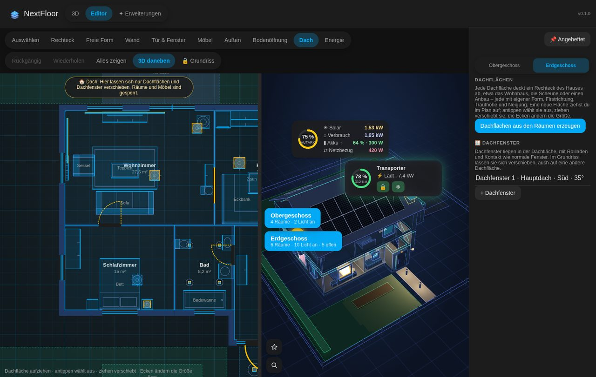

#### Roof windows

Below the roof sections, **+ Roof window** puts a window into a roof face (78 × 118 cm by default). Drag it in the plan, also onto another roof face. Like a window it has a **Blind**, a **Contact** and a **Tilt contact**: open, the sash swings out, hinged at the top; tilted, a little; the blind comes down over the glass from the top.

Every roof window has a **name** (optional), a **blind**, a **contact** and a **tilt contact** – and a **window motor**: Velux, Roto or Fakro report the window's position as a cover, and the sash opens in 3D as far as the motor stands. Open or tilted, the frame glows warm like a wall window's. In a roof section the window cuts a hole into the slope, so the attic looks out through it.

### 4.20 Energy: solar fields

In the **Energy** tool only solar fields and energy devices can be moved, in the plan and in 3D; rooms and furniture are locked there, as a note at the top of the plan says. The tool gathers everything about energy in the house, starting with the **solar fields** (meters, heating and heat pump will follow). **+ Solar field** puts a field on the sunniest free roof face, as large as fits. **+ Free-standing** puts a field on frames beside the house, e.g. in the garden or on a flat garage roof. **+ On a wall** hangs a row of modules on the sunniest outer wall of the floor shown (facade, balcony).

Drag fields in the plan and in the **3D view beside it**, also onto another roof face or wall. Roof windows work the same way in the **Roof** tool. The modules lie in the slope of the face; on a flat roof they stand on frames. This works on the single gable and flat roof and on all roof sections (gable, hip, pent, flat). On hip and pyramid roofs the two triangular **hip ends** are offered too, e.g. the south end of a hip roof with an east-west ridge; fields get narrower towards the tip.

| Field | Effect |
|---|---|
| **Roof face** | The face with its compass direction and pitch, e.g. "Main roof · south · 35°" |
| **Name** | E.g. "String 1 south"; several fields for several strings or roof faces |
| **Rows** and **Modules per row** | Size of the field. A list like **"4, 4, 3"** gives every row its own length (from the eave); shorter rows sit left, centred or right. Modules that would reach beyond the face are left out |
| **Modules on/off one by one** | Tap single modules in the plan to take them away or put them back, e.g. around a chimney or a roof window |
| **Full black** / **Blue** | Look of the modules: all black (default) or classic blue |
| **Module width** / **Module height** | Size of one module in portrait, 1.13 × 1.72 m by default |
| **Module power (Wp)** | Peak power of one module, 400 by default – sets the kWp of the field and its string and how bright the modules sparkle in the energy flow |
| **String** | Fields wired together, also on different roofs: e.g. 5 modules on the house and 5 on the garage in "String 1". A string has a name, a PV sensor and an inverter (added under **Devices**) |
| **PV power of this field** | The power sensor of its string, for the energy flow |
| **Portrait** / **Landscape** | How the modules (1.13 × 1.72 m) lie |
| **Distance from the edge** / **from the eave** | Position of the field. Drag it in the plan, also onto another roof face; it does not slide beyond the edge of its face |
| **Tilt of the frames** | Flat roofs and the garden: the angle of the frames, plus the direction |
| **Free-standing** | The field stands on frames and moves freely. **Height of the surface** lifts it, e.g. 2.8 m onto a garage roof (0 = ground). **Rotation** turns the rows, as do the ↺/↻ 15° buttons and the turn handle in the plan; the field turns about its middle |
| **Wall** | Modules hang on an outer wall; instead of "distance from the eave" there is the **height above the floor**. **Tilt away from the wall** angles them: standing off at the top or at the bottom, up to 90° as a canopy. The floor buttons at the top choose the floor you work on |
| **Fill face** | Puts as many modules on the face as fit |

Below the field you see its power, counted with 400 W per module. The plan lock does not hold solar fields; **🔓 Fix** in the form fixes a single field (and a roof window just the same). **Devices:** solar inverters, home batteries and wallboxes are added in the **Energy** tool as well, under **Devices**, on the floor chosen at the top. A wallbox goes into the garage by itself, inverters and batteries into a utility room (utility room, basement …), each against a wall without a door or gate, and the plan moves there. Tapping a device in the list shows it in the plan. There, in the Energy tool, every device carries a round marker with a symbol (⚡ inverter, 🔋 battery, 🔌 wallbox) to grab and move it by, also below a solar field on the roof. With a power sensor they show their watts. The **home battery** also shows its charge with the **State of charge** field, e.g. "64 % · ▲ 1.5 kW" (▲ charging, ▼ discharging), the **wallbox** "charging · 11 kW" or "plugged in" with a **Status** sensor.

**Meter and grid connection:** The **electricity meter** is the fourth energy device; it takes the grid sensor (W, + = import) and shows "Grid import 420 W" or "Export 900 W". The **grid connection** marks where the power line to the utility enters the plot, e.g. at the end of the driveway; it is first placed just outside the wall nearest to the meter and can be dragged in the plan. Every device has a **Name** field in its form ("Inverter north") that shows in the list, the form and on the pins in 3D, and inverters and batteries a **Model**: wall unit, slim and tall or hybrid; tower, wall battery or compact balcony battery. Several inverters and batteries work, e.g. a big plant and a balcony plant: each gets its own sensor.

**Energy balance:** NextFloor takes grid, solar and battery from the devices in the plan (meter, inverters, batteries; several add up, charges are averaged). In the **Energy balance** section you choose other sensors, flip signs and set the house consumption. **Take over from the energy dashboard** fetches the sensors you set up in Home Assistant's energy dashboard: for every energy statistic the power sensor of the same device. Check the signs afterwards.

What you set up here drives the energy flow in 3D, see [6.4](#64-energy-flow).

---

## 5. The 3D view

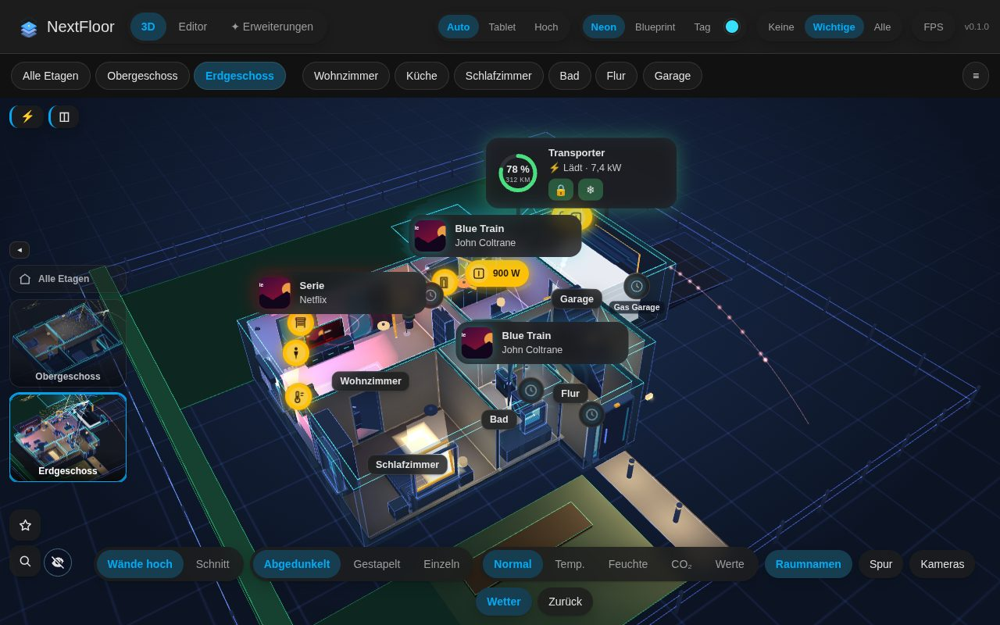

### 5.1 House, floor, room

The 3D view has three levels:

1. **The whole house** with a label per floor: rooms, lights on, open windows.
2. **One floor:** The floors above fly away, the ones below stay dimmed, stacked or hidden, as you choose.
3. **One room:** The camera flies in, the room panel opens.

**Navigating:**

- Tap a floor label or a room to go one level down.
- **Double tap** an empty spot, **Esc** or **Back** go one level up.
- Drag to turn the view, two fingers or the mouse wheel zoom.
- The **floor pictures** on the left jump straight to a floor. The small arrow above them folds them into plain floor buttons (the device remembers it); in the card `floor_thumbs: false` turns them off.
- Buttons at the top list all floors and the rooms of the open floor.

### 5.2 The switches at the bottom

| Switch | Effect |
|---|---|
| **Tall walls** / **Cut** | Walls at full height, the front ones as tinted glass, or all walls cut at hip height – tall furniture (wardrobe, stairs, tall units) is cut with them, so it hides nothing behind it |
| **Apart** / **Stacked** | In the house view: floors pulled apart or on top of each other |
| **Roof stays** | In the house view: the roof stays while zooming in instead of lifting and fading (in the editor's roof and energy tools it always stays) |
| **Dimmed** / **Stacked** / **Alone** | With an open floor: what happens to the floors below |
| **Normal** / **Temp.** / **Humidity** / **CO₂** / **Values** | Heatmap: floors coloured by the room's value; **Values** colours nothing and writes temperature, humidity and CO₂ as numbers under the room names |
| **Room names** | Show or hide the room names |
| **Trail** | Motion trail, see [6.1](#61-cameras) |
| **Weather** | Weather at the house, see [6.2](#62-weather-at-the-house) |
| **≡ / ↔** (right end of the floor and room bar) | Wrap the bar at the top onto several lines when many rooms do not fit in one, or back to one line; in one line it scrolls sideways, on a PC with the mouse wheel too. In the house view the rooms of every floor follow its name |
| **⚙** (phones only, top, next to the version) | Opens and folds the view options quality, look, markers and FPS; so the header takes only two lines on a phone |
| **Eye** (bottom left, next to the magnifier) | Hides everything that is not the 3D view: header, floor and room bar, energy values, floor pictures, switches. The stage alone remains – half a screen more on a phone. A tap on the eye brings it all back; rooms can still be tapped. The device remembers the choice |

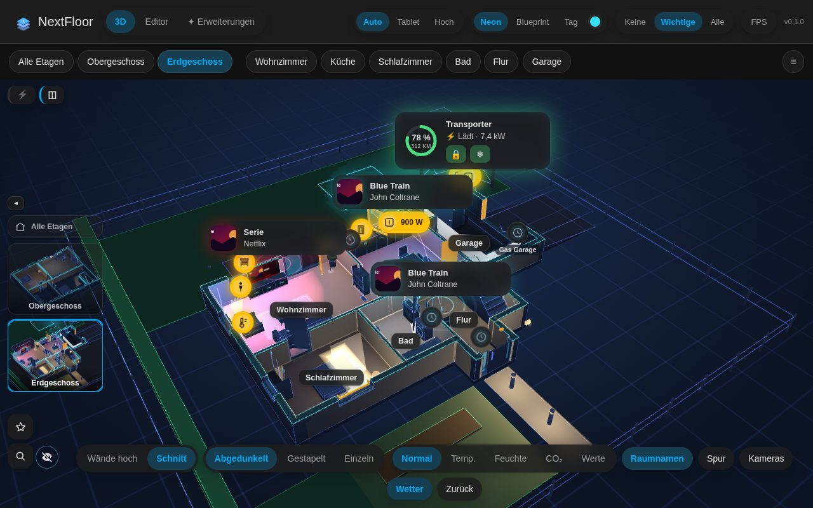

At the top right:

| Switch | Effect |
|---|---|
| **Auto** / **Tablet** / **High** | Quality level. Tablet leaves out patterns, shadows and halos and is chosen automatically on Fire tablets. High adds light cones under spots |
| **Neon** / **Blueprint** / **Day** | The look. The colour well beside it sets an **accent colour of your own**: in the neon look lines and glowing edges take it, the buttons and pins in every look; ↺ brings the cyan back |
| **None** / **Important** / **All** | Which device markers appear. Important shows only devices without their own 3D model and values such as watts or the running app |
| **FPS** | Frame rate, slowest frame and the reason for every drawn frame. At rest it reads 0 fps |

At the far right of the header stands the installed version (e.g. v1.11.0); hovering it shows which version the integration in Home Assistant reports.

Each device remembers these switches.

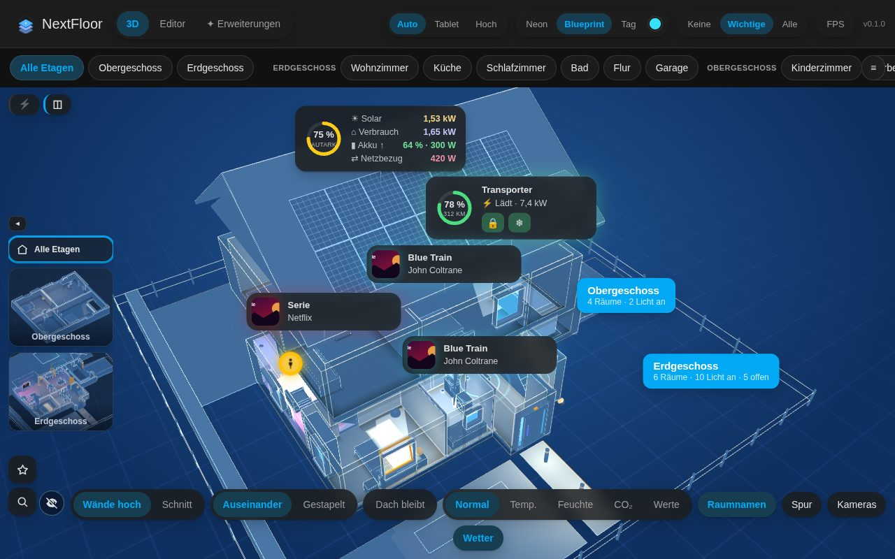

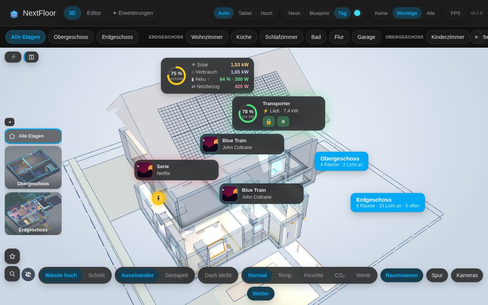

### 5.3 Controlling

- **Tap** switches lamps and switches. The lamp flashes briefly to confirm.
- **Swipe up or down** on a lamp dims it; on a blind or window it moves the blind. The value appears at your finger. Devices and windows with "Ask before switching" do not react to a swipe.
- **Long press** opens the quick menu: brightness, colour temperature and colours for lights; up, stop, down and fixed positions for blinds. Venetian blinds and Raffstores get a **Slats** slider there and in the room panel (or slats open/closed) as soon as the entity supports it.
- Tap a **window** – frame, glass or blind – to open the blind menu or show the contact.
- **Double tap a room** switches all its lights on or off. Devices with "Ask before switching" stay out.
- TVs, doors and garage doors can be tapped directly as well.

### 5.4 The room panel

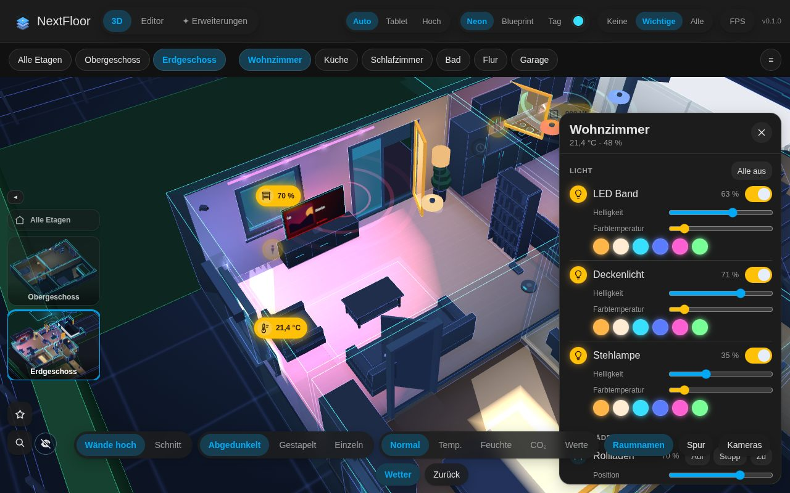

In a room the room panel opens on the right, at the bottom on phones and portrait tablets. It shows the room's devices by kind: lights with brightness, colour temperature and colours, **All on** and **All off**, covers with **All up** and **All down**, heating, media, switches, cameras with snapshot, sensors, and scenes & scripts.

It shows the devices placed in the room and everything you added with ☆ in the editor. **More devices of the area** shows the rest.

With a selected room and no open room panel, the area's **scenes and scripts** appear as buttons at the bottom.

### 5.5 Search

The **star** above the magnifier opens the **central menu**: lights on or off and blinds up or down for the floor shown – in the house view for the whole house, then with a confirmation ("Sure?", a second tap runs it). Garage doors and gates do not count as blinds. Below it the **favourites** from the editor; a tap starts a scene or script, presses a button or toggles a switch. In the card, `central: false` hides the star.

The magnifier at the bottom left opens **"Where is …?"**. Type a device or room name. A hit flies the camera there and the device flashes.

### 5.6 Heatmap

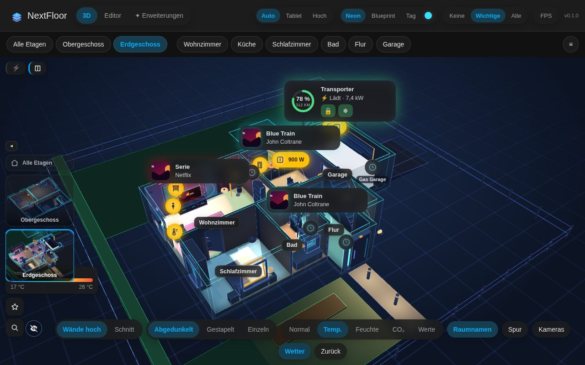

**Temp.**, **Humidity** and **CO₂** colour the floors by the area's sensors, with a colour scale at the edge. Temperatures appear in the unit set in Home Assistant (°C or °F); sensors in °F are converted correctly.

### 5.7 Sun and daylight

With north set, sunlight from `sun.sun` falls through the windows facing the sun as soft patches on the floor. Lowered blinds make the patches smaller. If you do not like the patches, switch off **Sunlight through the windows** in **Settings**. By day the sky behind the house gets lighter.

### 5.8 Warnings

NextFloor warns for free and without setup:

| Warning | Trigger |
|---|---|
| Smoke, gas, carbon monoxide, water | A `binary_sensor` of that device class in the area reports on |
| Alarm | An `alarm_control_panel` is triggered or about to trigger |
| Window open in the rain | A window is open or tilted while the weather entity reports rain, lightning rain, hail or sleet |

The room pulses red and a banner appears at the top. A tap on the warning jumps into the room. The rain warning uses the weather entity from the plan settings and can be switched off there on its own under **Warning: window open while it rains**.

### 5.9 Cameras in 3D

A tap on the camera or on its wedge opens the snapshot, which refreshes every few seconds. A tap on the picture opens the Home Assistant live view. The wedge is a much bigger target than the small camera.

---

## 6. Live features

Six features bring what happens in the house into the 3D view. They are built in and free, need no licence and nothing to install. Each one switches off on its own: in the 3D view with the switches at the bottom, in the card with its options (chapter 8).

### 6.1 Cameras

**Fly into a camera:** tap a camera in 3D, or choose **Look through the camera** in its snapshot menu or in the room panel. The view flies to where the camera hangs and looks its way, then the live picture fades in over the scene. **Back to the view** flies back. If the picture does not line up, correct the camera's rotation and tilt in the editor.

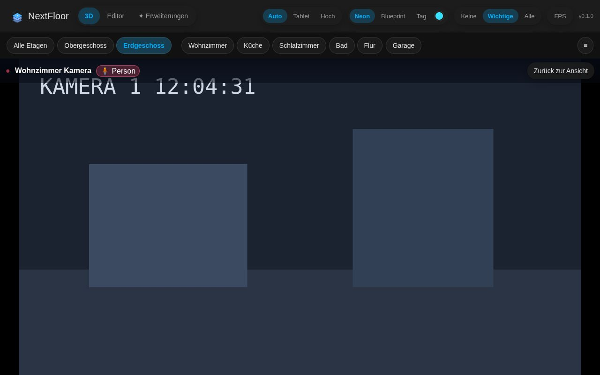

**Detection pins:** when one of a camera's sensors reports a detection right now (Frigate, UniFi Protect, Reolink and the like give one sensor per object), a pin stands in front of the camera: person 🧍, vehicle 🚗 or animal 🐾. NextFloor finds these sensors on the camera's device by itself; the camera form in the editor says how many it found.

**Camera wall:** the **Cameras** switch at the bottom (in the card the option `camera_wall: true`) shows every placed camera's picture side by side. A red frame marks a camera that sees motion right now. A tap shows one picture big, as a live stream when the camera can stream. Pictures come through Home Assistant's camera proxy over plain HTTP.

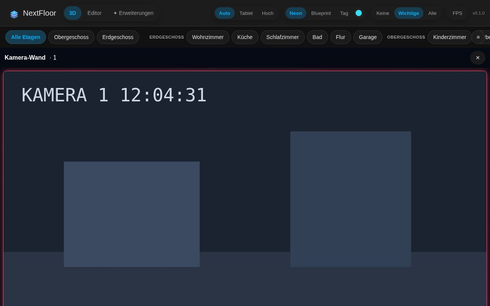

**Motion trail:** the **Trail** switch (card option `motion_trail: true`) draws where motion was reported in the last 30 minutes, in time order, as a glowing path through the house: faint blue where it is old, bright pink where it is new, with a comet running along it and a ring at every spot. Sources are motion, presence and occupancy sensors: placed ones where they stand, the others in the middle of the room of their area. The data comes from Home Assistant's history.

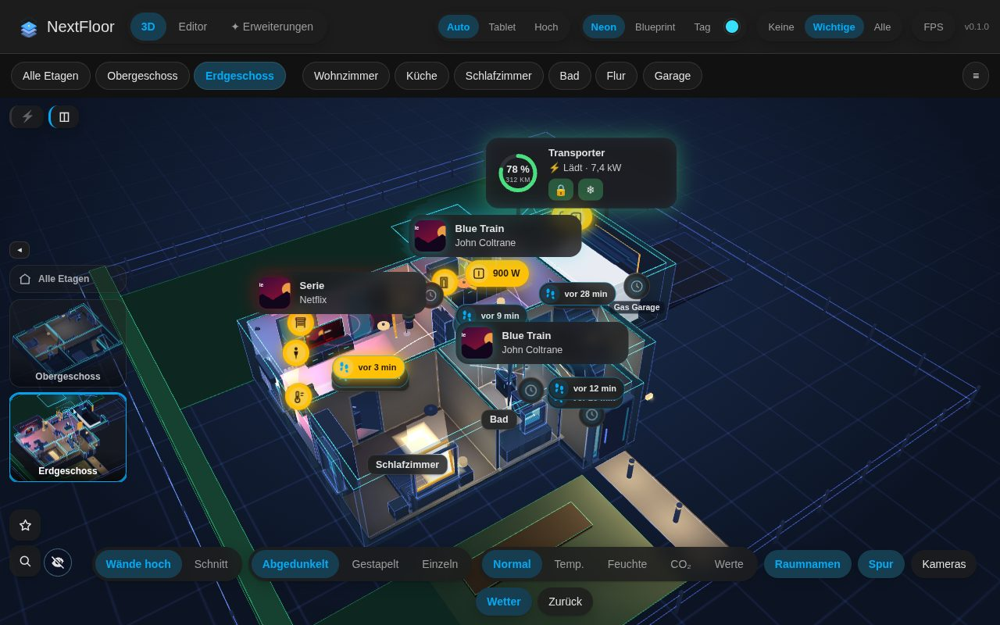

### 6.2 Weather at the house

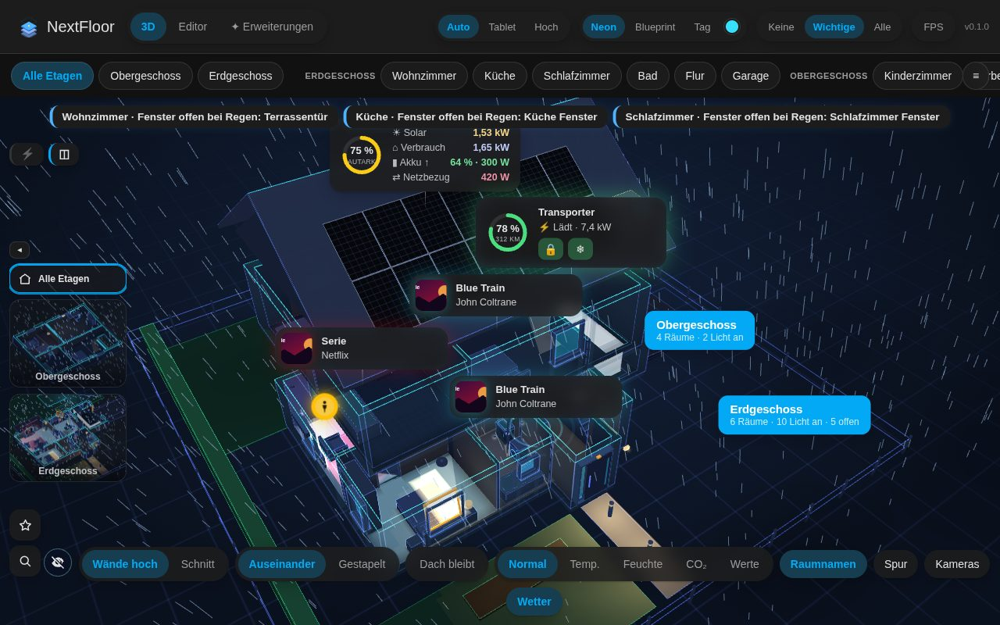

The weather around the house follows a `weather` entity:

| State | In 3D |
|---|---|
| rainy, pouring | Rain, with clouds |
| hail, snowy, snowy-rainy | Hail, snow, sleet |
| lightning, lightning-rainy | Lightning beside the house with a short flash, with rain for the second |
| fog | Fog that thickens with distance |
| cloudy, partlycloudy | Clouds drift over the plot with their shadows and dim the sky |
| windy | Wind drives rain and snow at an angle |
| sunny, clear-night | Sun by day, moon by night, in their real direction |

Where the entity has them, NextFloor also uses `cloud_coverage`, `wind_speed`, `wind_bearing`, the precipitation and the temperature (rain below freezing turns into sleet).

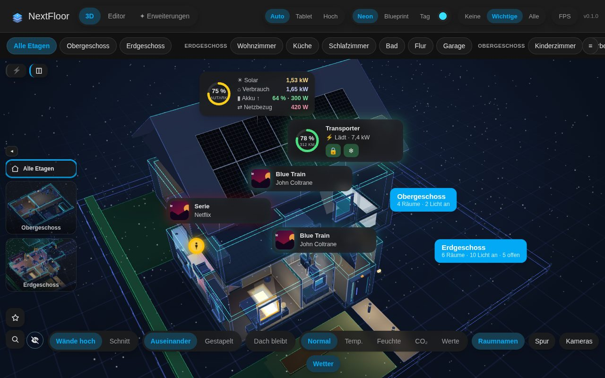

**Settings** in the editor: **Weather entity** picks the entity (automatic takes the first one), **Weather effects in 3D** switches single effects off. The **Weather** switch at the bottom of the 3D view and the card options `weather` and `weather_entity` do the same per view. On the Tablet quality level fewer particles fall.

### 6.3 TV screens

A TV or monitor linked to a media player shows in 3D what plays: the cover art, the title and the artist or series, and the app, on a gradient in the app's colour (Netflix red, Spotify green …). Behind it an ambilight glows on the wall in the same colour, breathing slowly while it plays. A media player placed as a device right beside a TV counts as that TV's player, so the TV item itself does not need a link.

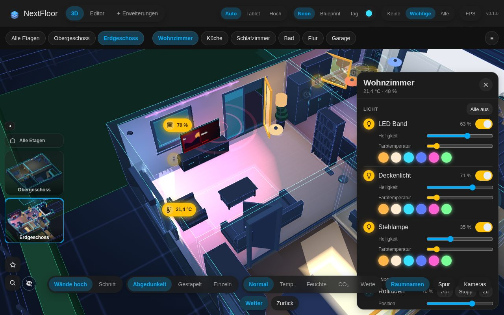

### 6.4 Energy flow

Everything for it is set up in the **Energy** tool ([4.20](#420-energy-solar-fields)): solar fields, inverters, batteries, wallbox, meter, grid connection and their sensors.

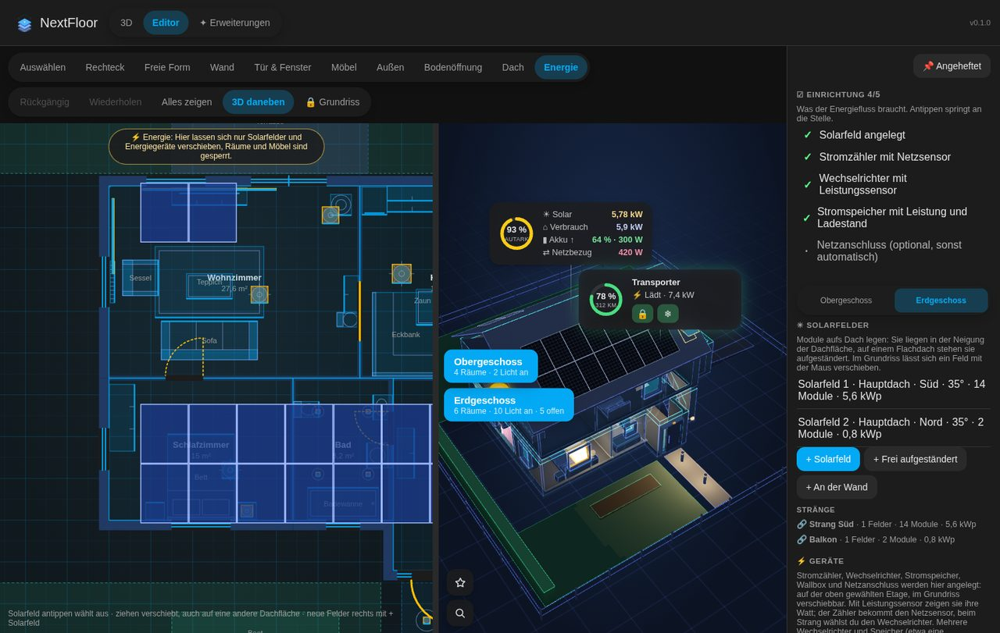

In the 3D view, glowing particles fly in arcs between the devices in the direction the power flows right now:

- every solar field sends its share of the production to its inverter,
- the battery charges from the house or discharges into it,
- the grid connection delivers to the house or takes the export,
- the house feeds every consumer that reports its power; a wallbox has its own colour.

More power means more and faster particles. "The house" is where the arcs meet: the meter cabinet, else the inverter, else the middle of the ground floor. The solar modules sparkle with their production. A glass card over the house shows the balance: sun, house, battery, grid and how self-sufficient the house is right now.

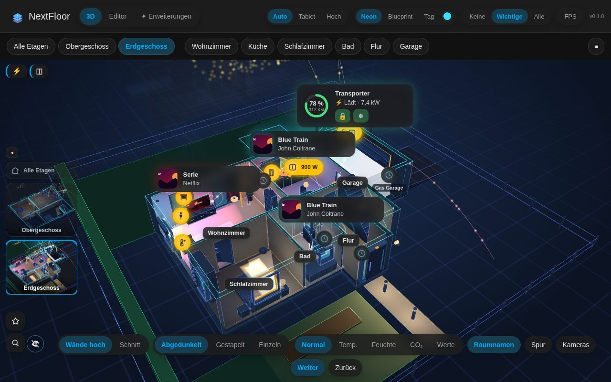

The **Power flow** switch in the energy bar shows or hides the arcs, **Cards** the live cards. In the card, `flows` and `holograms` fix them on or off; without them the card has its own switches.

### 6.5 Sound

It needs a speaker in the plan: a media player placed as a device, or an item (speaker, soundbar, TV …) with the media player as its **Device** in the furniture form.

- **Media card:** a card floats over every speaker or TV that plays, with cover, title and artist. Tap it for previous, play/pause, next and the volume. On phones the media cards stay hidden so they do not cover the rooms.
- **Sound rings** in the colour of the app spread from every playing speaker; louder reaches further.
- **Multiroom:** speakers that play together (`group_members`: Sonos, Music Assistant, HEOS, MusicCast …) are joined by a glowing thread.

What a player should bring: the state `playing`/`paused`, `media_title` and `media_artist`, `entity_picture` for the cover, `volume_level` for the slider and the rings. Echo devices through Alexa Media Player often set the volume late or not at all; that is the integration, not NextFloor.

### 6.6 Car

The car lives on a **parking spot** ([4.14](#414-parking-spots-and-vehicles)). In the parking spot form, **Car (an entity of the car)** takes any entity of the car; without it the spot's presence sensor is used. NextFloor finds the rest on the car's device by itself: charge level, range, charging power, charging and plugged in, lock, climate, inside temperature and the charge switch. It works with TeslaMate (MQTT), Tesla Fleet and the car integrations that put their entities on one device (VW, BMW, Hyundai/Kia, Renault, Polestar …).

A glass card over the spot shows the charge with a colour ring, the range, charging with its power, the plug and the inside temperature, with buttons for **Lock / Unlock** (unlocking asks first), the climate and charging. While the car charges, energy particles fly into it from the wallbox. When it is away, the card says where it is.

---

## 7. Extensions and furniture packs

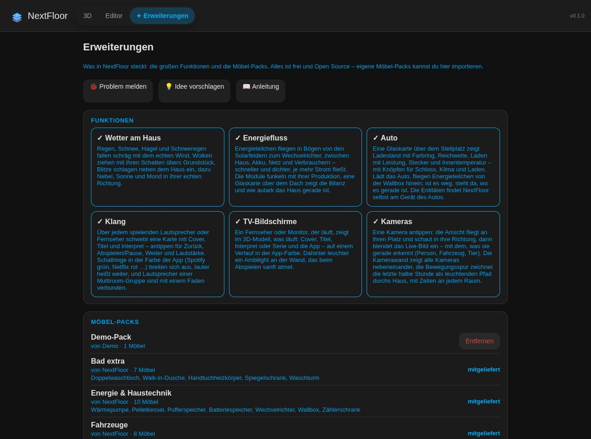

The **✦ Extensions** tab shows what NextFloor brings: the six live features of chapter 6 and the furniture packs.

### 7.1 Built-in packs

Eleven packs come with the integration and are always there:

| Pack | Contents |
|---|---|
| Living & pets | Corner sofa, fireplace, piano, aquarium, cat tree, dog bed and more |
| Kitchen extra | More kitchen units and appliances |
| Bath extra | More bathroom furniture |
| Bedroom & kids | Beds, wardrobes, kids' furniture |
| Home cinema & gaming | Screen, projector, speakers, soundbar, gaming desk and chair, console, arcade cabinet |
| Office & homelab | Standing desk, server rack, NAS, 3D printer, router, tower PC |
| Fitness | Training equipment |
| Garden & terrace | Garden furniture, grill, pool, hot tub, greenhouse, robotic mower, trees and hedges |
| Energy & building services | Heat pump, pellet boiler, tanks, home battery, inverter, wallbox, meter cabinet, ventilation |
| Vehicles | Tesla models, an electric SUV, small car, van, bikes and a trailer for parking spots |
| IKEA sizes | Bookcases, cube shelves, beds, chests of drawers, wardrobes, sofas, desk and tables in popular IKEA sizes |

Devices in packs have a small glowing part (display, status LED): linked to a media player, a switch or a light, it lights up while the device runs.

### 7.2 Your own packs

**Import furniture packs …** at the bottom of the page imports pack files, several at once. A pack is plain JSON; the format is described in [packs.md](packs.md) (German).

- If you remove a pack, its furniture stays in the plan as plain boxes. Import it again and it is back, with all its links.
- A newer version of a pack replaces the old one without losing anything in the plan.
- Built-in packs cannot be removed.

---

## 8. The dashboard card

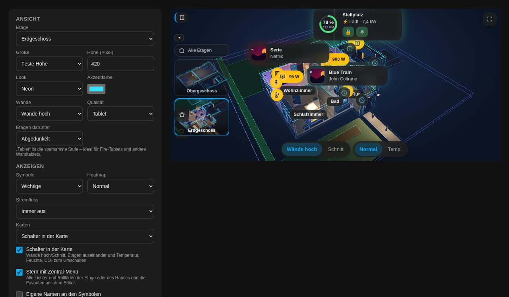

The card `custom:nextfloor-card` brings the 3D view into any dashboard. It loads automatically.

**Adding it:** Edit the dashboard, **Add card**, search for "NextFloor". Set every option in the card's visual editor:

| Section | Options |
|---|---|
| **View** | One floor or the whole house, fixed size or full screen, height, look, walls, quality, floors below |
| **Show** | Markers, heatmap, switches in the card, floor pictures, room names, room panel, full-screen button, floors apart, performance display |
| **Features** | Warnings, jump to a warning, scene buttons, motion trail, weather with weather entity |
| **Wall tablet (kiosk)** | Back to the start view, night dimming, camera turn as screensaver |

In YAML a card looks like this. Every line except the first is optional:

```yaml
type: custom:nextfloor-card
floor: floor_ab12cd34   # show one floor (id from the editor)
room: room_ab12cd34     # start in this room (id from the editor), e.g. a display for the kids' room
height: 420             # height in pixels
fill: false             # fill the screen below the header
walls: auto             # auto | cut
explode: true           # pull floors apart in the house view
floor_stack: dim        # floors below: dim | stacked | single
quality: auto           # auto | low | high
theme: neon             # neon | blueprint | day
accent: "#ff8a00"       # an accent colour of your own (neon lines, buttons, pins); leave out for cyan
markers: important      # none | important | all
marker_names: false     # true: devices with an own name show it under their marker
central: true           # the star with the central menu (all lights, blinds, favourites)
buttons:                # own buttons for this card only (replace the ones from the editor)
  - label: Blinds
    icon: window-shutter
    action: fire_dom_event   # navigate | more_info | service | fire_dom_event
    data: { browser_mod: { service: browser_mod.popup, data: { title: Blinds, content: { type: "custom:my-blind-card" } } } }
heatmap: none           # none | temperature | humidity | co2
room_panel: true        # tapping a room opens the room panel
room_names: true
controls: true          # switches in the card, or a list: walls, floors, temperature, humidity, co2
controls_hidden: false  # true: start with the controls hidden (only the 3D view); an eye at the bottom left brings them back
controls_hide_after: 0  # seconds without a touch after which the controls disappear (0 = never); a touch shows them again
floor_thumbs: true
fullscreen_button: false
dashboard: /lovelace/home   # a button at the top right that opens this dashboard (leave out = no button)
dashboard_label: Home       # label of the button; without one it shows ⌂
stats: false
alerts: true
alert_jump: false       # jump into the room of a new warning
scenes: true
motion_trail: false     # cameras: motion trail
weather: true           # weather at the house
weather_entity: weather.home
holograms: true         # live cards always on/off; leave out = a switch in the card
camera_wall: false      # a "Cameras" button at the bottom of the card opens the camera wall
roof_fade: true         # false: the roof stays on the house while zooming in
start_view: { theta: 0.8, phi: 1.0, radius: 20 }   # a start view of this card's own; the line is shown in the editor under Start view (leave out = the plan's)
idle_return: 0          # seconds without a touch until the start view
night: "off"            # off | sun | "22:00-06:00"
idle_orbit: false
```

---

## 9. NextFloor on a wall tablet

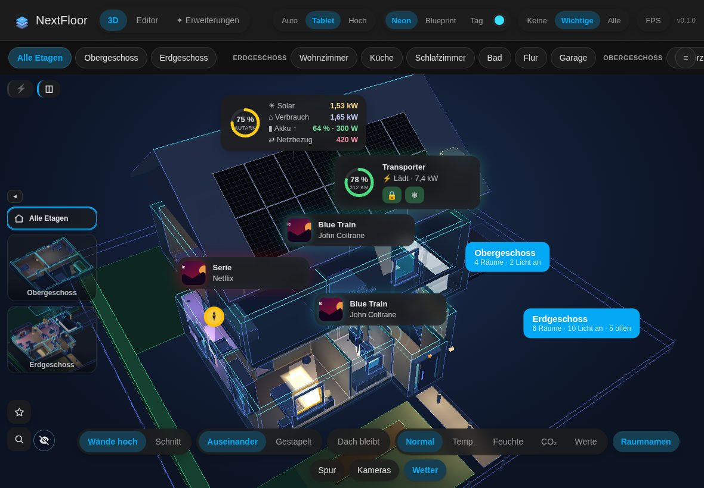

NextFloor is built for wall tablets such as the Amazon Fire:

- **No work while idle.** If nothing changes, the view draws not a single frame. The FPS display then reads "At rest (0 fps)".
- **Tablet quality level:** "Auto" picks it by itself on Fire tablets. Patterns, shadows, halos and particles are left out, animations run at half rate.
- **Kiosk options of the card:** After a few minutes without a touch the card returns to the start view. At night it dims by the sun or by the clock. As a screensaver the house turns slowly.
- **Warnings** can jump into the affected room by themselves.
- In portrait the room panel appears at the bottom.

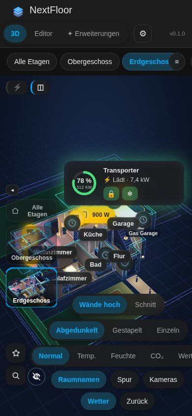

**Tips for Fire tablets:** Use Fully Kiosk Browser with hardware acceleration, show the card full screen with `fill: true` and keep `quality: auto`.

---

## 10. Backup and moving

Under **Backup** in the editor:

- **Restore points** are kept at most every 10 minutes while you edit, the last 20 stay. **Restore** brings back a state, the current one is kept as a restore point itself.
- **Export** saves the plan as a file, **Import …** loads such a file.
- **Share as template** exports without areas, devices, sensors and pictures. Good for passing a floor plan on.
- **Full backup:** **Back up everything (plan, pictures, packs)** saves one file with the plan, every background and screen picture and the installed packs. **Restore a full backup …** brings it back into the same or another installation.

Home Assistant's own backup includes NextFloor completely as well.

---

## 11. Data and privacy

- The plan, pictures and packs are stored in Home Assistant under `.storage`. None of it leaves your installation.
- NextFloor does not connect to the internet.
- Camera pictures, history and states stay in Home Assistant and are only shown in the browser.

---

## 12. FAQ and troubleshooting

**Help and feedback:** report a bug as an [issue on GitHub](https://github.com/therealMRBK/NextFloor/issues/new/choose) and an idea as a [discussion](https://github.com/therealMRBK/NextFloor/discussions/categories/ideas). Nothing gets lost, everyone sees the state, and you are credited in the release notes once it is built. The two buttons for it are also at the bottom of the editor's sidebar and on the Extensions page.

**How do I get the latest update?**
Settings → System → Updates. HACS only looks for new versions every few hours, so a fresh update may not show there yet. Then: HACS → NextFloor → ⋮ → **Update information** → **Download**. Then restart Home Assistant and reload the page (Ctrl+F5; in the Companion app: Settings → Companion app → reset frontend cache).

**Can I use helpers instead of real sensors?**
Yes. Wherever NextFloor expects a number (power, charge, range, position …), `input_number` and `number` helpers can be picked too, and wherever it expects on/off (contact, presence …), `input_boolean` as well. For power the helper needs the unit W or kW.

**An Echo's volume does not change.**
Alexa Media Player does not set the volume on some Echos, or only with a delay, and reports the new value late. Check it in Developer tools → Actions with `media_player.volume_set`: if nothing happens there, it is the integration (see [6.5](#65-sound)).

**"Restart needed" appears at the top.**
After an update the old version still runs in the background. Restart Home Assistant.

**A device is missing in a room's device list.**
The room needs an area, and the device must belong to that area, either the device or the entity itself. If the entity sits under a device with several entities, it is behind "+n more". The search field finds it directly.

**A camera is hard to hit.**
Tap its wedge on the floor, it counts like the camera.

**Furniture shows as grey boxes.**
The pack it comes from is not installed. Import it again.

**Dragging in 3D, an item does not pass through the wall.**
That is on purpose: in the 3D view furniture and devices stay in their room while dragged and slide along the wall. Move them into another room in the floor plan, where they move freely.

**A tap hits the device in the next room.**
Walls catch taps. In the room view only things in the room count. If it still hits the wrong thing, the **Cut** switch helps.

**The view stutters on the tablet.**
Set quality to **Tablet** and check with **FPS** what is drawing. At rest it should read 0 fps. If something keeps running, the reason is shown next to it, e.g. a lamp's colour effect.

**Sunlight falls through the wrong windows.**
Check **North** under Settings: degrees clockwise from "up" in the plan.

**The notice "This page still shows NextFloor x.y, Home Assistant already has …" stays.**
The browser or the companion app still holds an old NextFloor bundle. Tap **Reload**; in the companion app go to Settings → Companion app → **Reset frontend cache**, then close the app completely and open it again. Restarting Home Assistant does not help here.

**Where do I report bugs?**
In the issue tracker on GitHub: https://github.com/therealMRBK/NextFloor/issues
